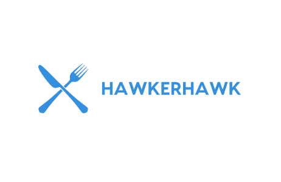

<!--
*** Thanks for checking out the Best-README-Template. If you have a suggestion
*** that would make this better, please fork the repo and create a pull request
*** or simply open an issue with the tag "enhancement".
*** Thanks again! Now go create something AMAZING! :D
-->

<!-- PROJECT SHIELDS -->
<!--
*** I'm using markdown "reference style" links for readability.
*** Reference links are enclosed in brackets [ ] instead of parentheses ( ).
*** See the bottom of this document for the declaration of the reference variables
*** for contributors-url, forks-url, etc. This is an optional, concise syntax you may use.
*** https://www.markdownguide.org/basic-syntax/#reference-style-links
-->

[![Contributors][contributors-shield]][contributors-url]
[![Forks][forks-shield]][forks-url]
[![Stargazers][stars-shield]][stars-url]
[![Issues][issues-shield]][issues-url]
[![MIT License][license-shield]][license-url]

<!-- PROJECT LOGO -->
<br />
<p align="center">
  <a href="https://github.com/othneildrew/Best-README-Template">
    
  </a>

  <h3 align="center">Hawker Hawk</h3>

  <p align="center">
    View hawker centres and store information and contribute to the list.
    <br />
    <a href="https://github.com/seangoats/HawkerHawk"><strong>Explore the docs »</strong></a>
    <br />
    <br />
    <a href="http://hawker-hawk.vercel.app/">View Demo</a>
    ·
    <a href="https://github.com/seangoats/HawkerHawk/issues">Report Bug</a>
    ·
    <a href="https://github.com/seangoats/HawkerHawk/issues">Request Feature</a>
  </p>
</p>

<!-- TABLE OF CONTENTS -->
<details open="open">
  <summary>Table of Contents</summary>
  <ol>
    <li>
      <a href="#about-the-project">About The Project</a>
      <ul>
        <li><a href="#built-with">Built With</a></li>
      </ul>
    </li>
    <li>
      <a href="#getting-started">Getting Started</a>
      <ul>
        <li><a href="#prerequisites">Prerequisites</a></li>
        <li><a href="#installation">Installation</a></li>
      </ul>
    </li>
    <li><a href="#contributing">Contributing</a></li>
    <li><a href="#license">License</a></li>
    <li><a href="#contact">Contact</a></li>
  </ol>
</details>

<!-- ABOUT THE PROJECT -->

## About The Project

-   Allows to view all hawker centres in Singapore
-   Closing times
-   Store menus and opening hours
-   Add a new store

### Built With

-   [NextJS](https://nextjs.org/)
-   [Supabase](https://supabase.com/)
-   [Axios](https://axios-http.com/)
-   [MaterialUI](https://mui.com/)
-   [TypeScript](https://www.typescriptlang.org/)
-   [Vercel](https://vercel.com/) (For deployment)
-   [data.gov.sg](https://data.gov.sg/) (API used to get hawker centres information)

<!-- GETTING STARTED -->

## Getting Started

To get a local copy up and running follow these simple example steps.

### Prerequisites

This is an example of how to list things you need to use the software and how to install them.

-   npm
    ```sh
    npm install npm@latest -g
    ```

### Installation

1. Clone the repo

    ```sh
    git clone https://github.com/your_username_/Project-Name.git
    ```

2. Install NPM packages with yarn or npm

    ```sh
    yarn add
    ```

    OR

    ```sh
    npm install
    ```

<!-- CONTRIBUTING -->

## Contributing

1. Fork the Project
2. Create your Feature Branch (`git checkout -b feature/AmazingFeature`)
3. Commit your Changes (`git commit -m 'Add some AmazingFeature'`)
4. Push to the Branch (`git push origin feature/AmazingFeature`)
5. Open a Pull Request

<!-- LICENSE -->

## License

Distributed under the MIT License. See `LICENSE` for more information.

<!-- CONTACT -->

## Contact

Creator: [@seangoats](https://github.com/seangoats)

Project Link: [https://github.com/seangoats/HawkerHawk](https://github.com/seangoats/HawkerHawk)

<!-- ACKNOWLEDGEMENTS -->

<!-- MARKDOWN LINKS & IMAGES -->
<!-- https://www.markdownguide.org/basic-syntax/#reference-style-links -->

[contributors-shield]: https://img.shields.io/github/contributors/othneildrew/Best-README-Template.svg?style=for-the-badge
[contributors-url]: https://github.com/othneildrew/Best-README-Template/graphs/contributors
[forks-shield]: https://img.shields.io/github/forks/othneildrew/Best-README-Template.svg?style=for-the-badge
[forks-url]: https://github.com/seangoats/HawkerHawk/network/members
[stars-shield]: https://img.shields.io/github/stars/othneildrew/Best-README-Template.svg?style=for-the-badge
[stars-url]: https://github.com/seangoats/HawkerHawk/stargazers
[issues-shield]: https://img.shields.io/github/issues/othneildrew/Best-README-Template.svg?style=for-the-badge
[issues-url]: https://github.com/seangoats/HawkerHawk/issues
[license-shield]: https://img.shields.io/github/license/othneildrew/Best-README-Template.svg?style=for-the-badge
[license-url]: https://github.com/seangoats/HawkerHawk/blob/master/LICENSE
[product-screenshot]: images/screenshot.png
